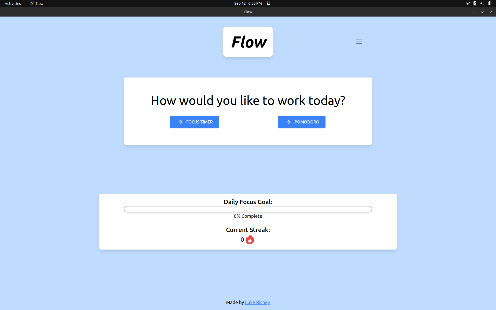

# Flow: A Focus App

Flow is an Electron application built with React and TypeScript, designed to help you focus on your work. With features like Pomodoro mode, focus timer mode, and streak maintenance, Flow provides a flexible approach to time management.



## Features

- **Pomodoro Mode**: Work in blocks of time to maintain high focus.
- **Focus Timer Mode**: Customizable focus timer for your specific needs.
- **Streak Maintenance**: Keep track of your productivity and stay motivated.

## Recommended IDE Setup

I recommend using [VSCode](https://code.visualstudio.com/) paired with [ESLint](https://marketplace.visualstudio.com/items?itemName=dbaeumer.vscode-eslint) and [Prettier](https://marketplace.visualstudio.com/items?itemName=esbenp.prettier-vscode) for a seamless development experience.

## Quick Start

### Installation

Clone the repository and navigate to the project directory:

```bash
$ git clone https://github.com/lukebrichey/flow.git
$ cd flow
```

Install the dependencies:

```bash
$ npm install
```

### Development

Start the development server:

```bash
$ npm run dev
```

### Building the App

To build the application for your platform:

#### Windows:

```bash
$ npm run build:win
```

#### macOS:

```bash
$ npm run build:mac
```

#### Linux:

```bash
$ npm run build:linux
```

## Usage

1. Run the built executable relevant to your OS.
2. Upon launching the application, you'll see multiple modes to choose from (Pomodoro, Focus Timer, Streak Maintenance).
3. Choose your preferred mode and click start.

Now you can work in peace and Flow will handle your focus sessions!

## Contributions

Contributions are welcome! Please feel free to make a pull request.

## License

This project is licensed under the MIT License. See [LICENSE](LICENSE.md) for details.
